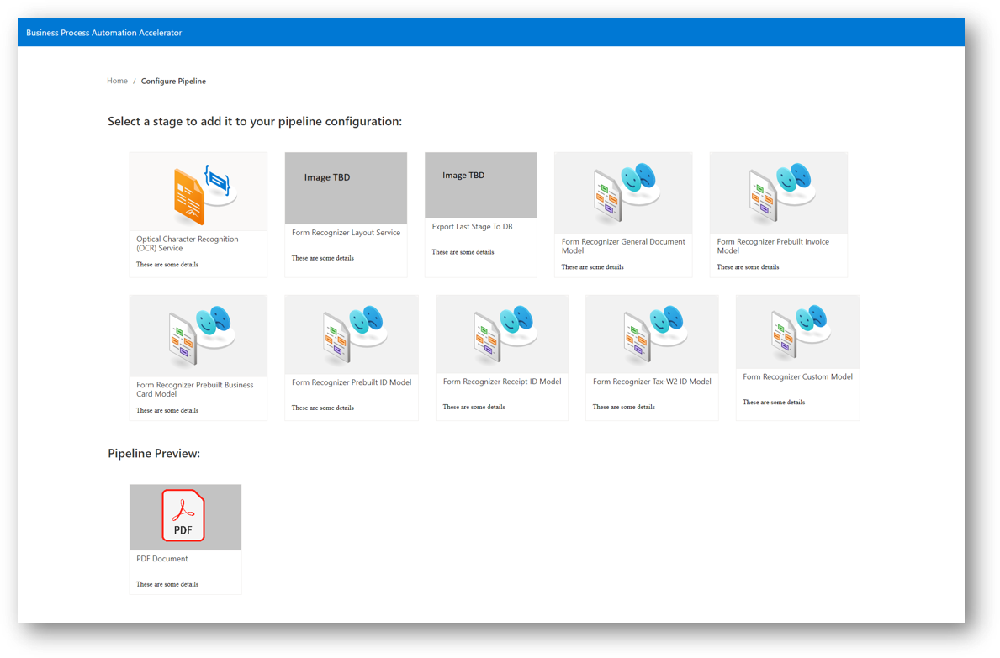
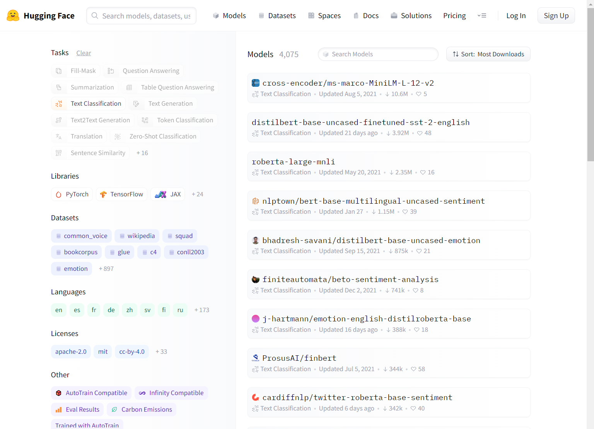
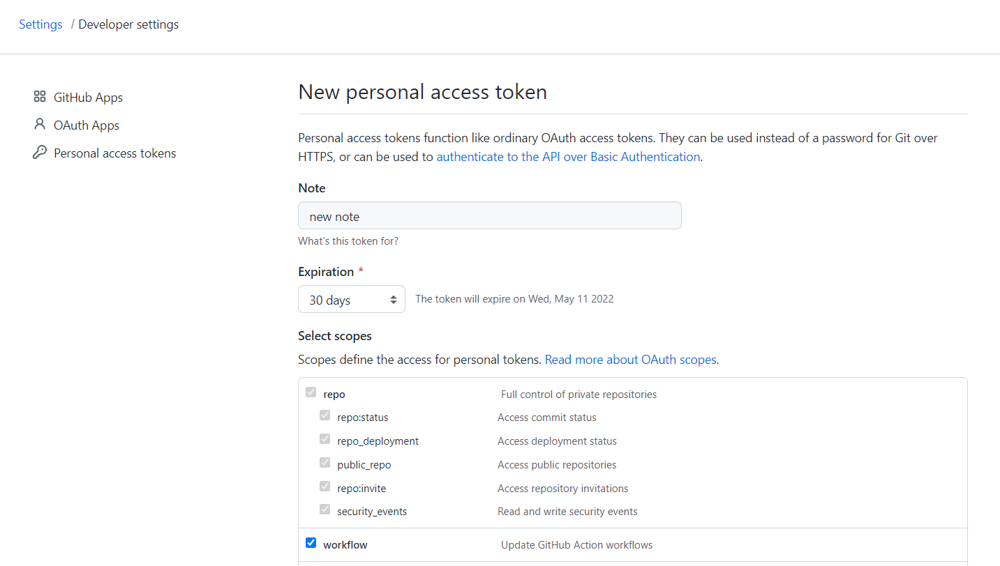
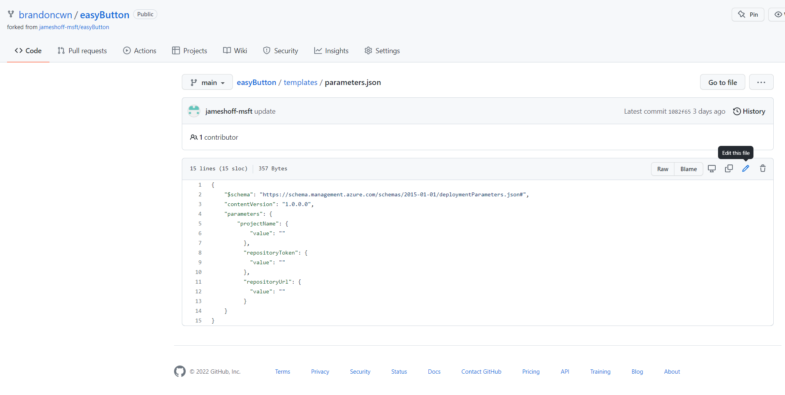
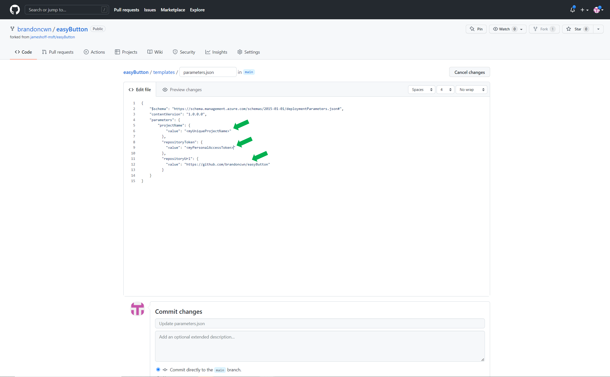
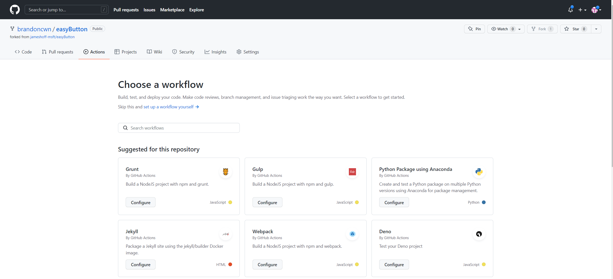
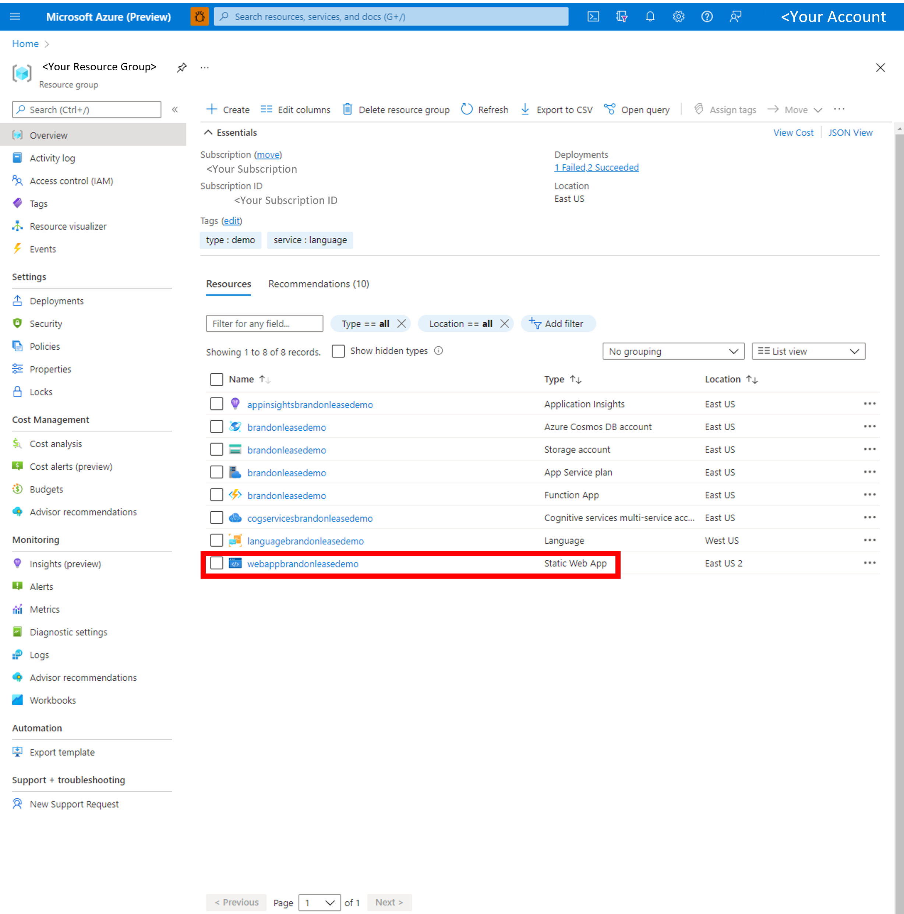

# Business Process Accelerator

## Overview

[Azure Static Web Apps](https://docs.microsoft.com/azure/static-web-apps/overview) allows you to easily build [React](https://reactjs.org/) apps in minutes. Use this repo with the [React quickstart](https://docs.microsoft.com/azure/static-web-apps/getting-started?tabs=react) to build and customize a new static site and automate the deployment of a functional, and customizable, POC for text and language processing. 

This repo will create, and manage, a set of cognitive services and app resources, and most of the individual resource crendentials in your newly created Resource Group. And provide a React UI for uploading documents, creating language and audio pipelines using a variety of user-specified Azure Cogntive Services, and exporting the results. 

The following guide will present a high-level overview of the deployment architecture, with step-by-step instructions for immediate deployment, with several simple command-line steps.

- [Overview](#overview)  
- [Architecture](#architecture)  
- [Currently Inluded Algorithms](#currently-inluded-algorithms)  
- [Prerequisities](#prerequisities)  
- [Installation Steps](#installation-steps)  
  - [Navigate to and open for editing, easyButton/templates/templates.json in your local directory](#navigate-to-and-open-for-editing,-easybutton/templates/templates.json-in-your-local-directory)
  - [Clone your repo locally](#5-clone-your-repo-locally)
  - [Run initial deployment configuration](#run-initial-deployment-configuration)
  - [Create action to deploy](7-create-action-to-deploy)
  - [Launch App](#8-launch-app)
  - [Load Documents!](#load-documents)
- [Contacts](#contacts)  
- [Roadmap](#roadmap)
- [References](#references)  
---

## Architecture
Once you've created a high-level Resource Group, you'll fork this repository and create a Github Actions Pipeline, automatically importing helper libraries and taking advantage of Github Actions to deploy the set of Azure Cognitive Services and manage all of the new Azure module credentials, in the background, within your newly created pipeline. Once the pipeline is deployed, a static webapp will be created with your newly customizable POC UI for document processing!

## Currently Included Algorithms
The initial release includes Cognitive Services provided by Azure Language Service and Form Recognizer, such as text classification and custom named entity recognition, as well as standardized interface for deploying State-of-the-Art Hugging Face models. Additional tasks and models are on the roadmap for inclusion (see Roadmap section later in this document).
#### Form Recognizer Models  

| Model | Description |
| ----- | ----------- |
|Read (preview)	| Extract printed and handwritten text lines, words, locations, and detected languages. |
| General document (preview) |	Extract text, tables, structure, key-value pairs, and named entities.|
| Layout |	Extract text and layout information from documents.|  

 Prebuilt  
| Model | Description |
| ----- | ----------- |
| W-2 (preview) |	Extract employee, employer, wage information, etc. from US W-2 forms.|
|Invoice	| Extract key information from English and Spanish invoices.|
|Receipt	| Extract key information from English receipts.|
|ID document	| Extract key information from US driver licenses and international passports.|
|Business card	| Extract key information from English business cards.|  

Custom
| Model | Description |
| ----- | ----------- |
| Custom |	Extract data from forms and documents specific to your business. Custom models are trained for your distinct data and use cases. |
| Composed |	Compose a collection of custom models and assign them to a single model built from your form types.|  

https://docs.microsoft.com/en-us/azure/applied-ai-services/form-recognizer/concept-model-overview
#### Language Service Models

| Model | Description |
| ----- | ----------- |
|Named Entity Recognition (NER)|	This pre-configured feature identifies entities in text across several pre-defined categories.|
|Personally Identifiable Information (PII) detection	|This pre-configured feature identifies entities in text across several pre-defined categories of sensitive |information, such as account information.|
|Key phrase extraction|	This pre-configured feature evaluates unstructured text, and for each input document, returns a list of key phrases and main points in the text.|
|Entity linking	|This pre-configured feature disambiguates the identity of an entity found in text and provides links to the entity on Wikipedia.|
|Text Analytics for health|	This pre-configured feature extracts information from unstructured medical texts, such as clinical notes and doctor's notes.|
|Custom NER|	Build an AI model to extract custom entity categories, using unstructured text that you provide.|
|Analyze sentiment and opinions|	This pre-configured feature provides sentiment labels (such as "negative", "neutral" and "positive") for sentences and documents. This feature can additionally provide granular information about the opinions related to words that appear in the text, such as the attributes of products or services.|
|Language detection	|This pre-configured feature evaluates text, and determines the language it was written in. It returns a language identifier and a score that indicates the strength of the analysis.|
|Custom text classification (preview)	|Build an AI model to classify unstructured text into custom classes that you define.|
|Text Summarization (preview)	|This pre-configured feature extracts key sentences that collectively convey the essence of a document.|
|Question answering|	This pre-configured feature provides answers to questions extracted from text input, using semi-structured content such as: FAQs, manuals, and documents.|

https://docs.microsoft.com/en-us/azure/cognitive-services/language-service/overview

#### Hugging Face Implementation
Many of the pretrained models from the huggingface library can be used, depending on the task selected! Find more information at https://huggingface.co/models?pipeline_tag=text-classification&sort=downloads

## Prerequisities
1. Github account
2. Ensure your subscription has Microsoft.DocumentDB enabled  
To check:  
    a. Go to your subscription within portal.azure.com  
    b. Select Resource Providers at bottom of left navigation pane  
    c. Within the Filter by name menu, search for Microsoft.DocumentDB  
    d. Once Microsoft.DocumentDB is found, check if the status is marked as "Registered". If marked as "NotRegistered", Select "Register"  
    **Note**:*This process may take several seconds/minutes, be sure to refresh the entire browser periodically*
3. Ensure that you have accepted terms and conditions for Responsible AI
 "You must create your first Face, Language service, or Computer Vision resources from the Azure portal to review and acknowledge the terms and conditions. You can do so here: Face, Language service, Computer Vision. After that, you can create subsequent resources using any deployment tool (SDK, CLI, or ARM template, etc) under the same Azure subscription."

## Installation Steps

## 1. Create a Resource Group in your Azure Portal
Create your Resource group.
Select your preferred Region
  
https://docs.microsoft.com/en-us/azure/azure-resource-manager/management/manage-resource-groups-portal  

It will take a few seconds for your Resource Group to be created.
  
For more help, refer to https://docs.microsoft.com/en-us/azure/azure-resource-manager/management/manage-resource-groups-portal  

## 2. Fork the repo
Fork https://github.com/Azure/business-process-automation to your github account. For basic instructions please refer to https://docs.microsoft.com/en-us/azure/devops/repos/git/forks?view=azure-devops&tabs=visual-studio  
**Note**: *a Microsoft organization github account is **not** required*  

## 3. Create AND save personal access token
1.  On your github repo page, click your profile  
2.  Select Settings (under your profile icon in the top right)
3. Select Developer settings at bottom of left navigation pane  
4.  Select Personal access tokens  
    
5.   Select Generate personal access token  
    
6..  Under Select scopes, select the checkbox for "workflow"  
    
7.. Add your own description  
8. Select Generate token  
9..  Copy your newly generated token  
  **Note**: *Be sure to save this token for completing pipeline setup, else this token will need to be regenerated*  
  
  For further information refer to https://docs.microsoft.com/en-us/azure/devops/organizations/accounts/use-personal-access-tokens-to-authenticate

## 4. Navigate to and open for editing, templates/parameters.json in your local directory
1. Open a command window  
2. Clone the forked repo locally   - `git clone https://github.com/<your-account>/business-process-automation`
3. Navigate to  
Update the three "value" fields below:  

  

4. projectName = must be a unique project name, keep to lowercase, alphanumeric characters only  
5. repository token: copy the personal access token you recently created  
6. repository url: paste the link of your forked repository  - should be something like https://github.com/<your-account>/business-process-automation
  
  

  
## 5. Run initial deployment configuration  
1. In your local repository, navigate to the 'templates' directory  
2. Run `az deployment group create --name ExampleDeployment --resource-group easybutton --template-file main.json --parameters parameters.json`  
  **Note**: *This may take several minutes to run*  
3. When this has completed you should have the application infrastructure deployed to your resource group.  View the resource group in your portal to confirm.
  
## 6. Collect the Publish Profiles for your Function Apps
1.  You will have two function apps deployed.  One will start with the name "huggingface".  Open the "huggingface" function app and in the "overview" tab there will be a button "Get publish profile" in the top center.  When you press the button it will download a file.  This is your AZURE_HF_FUNCTIONAPP_PUBLISH_PROFILE.
2.  From your forked repo, go to Settings (local settings in the middle center) -> Secrets -> Actions
3.  Add Repository Secret
4.  Copy the publish profile contents in "value" and the name will be AZURE_HF_FUNCTIONAPP_PUBLISH_PROFILE
  
5.  Do the same process for the function application that starts with your unique application name.  Get the publish profile.  This is AZURE_FUNCTIONAPP_PUBLISH_PROFILE under Secrets->Actions.

## 6. Create Github Action to build the code and deploy it to your Function Apps
1. Navigate to actions tab  
2. Select create new workflow  
3. Select set up workflow yourself  
  
4. Copy the contents of templates/deploy.yml to create a custom workflow
5. Run the workflow and select commit new file
  **Note**:*Once you've run your workflow once, you'll want to delete previous workflow runs to prevent buildup of old workflows.
6. View the progress of your actions under the "Actions" tab.  This can take over 10 minutes to complete.
 
## 7. Launch App  
1. Navigate to your Resource Group within your Azure Portal <insert static web app screenshot here>  
2. Select your static webapp  
3. Within the default Overview pane, Select your URL to navigate to the WebApp, this take you to the newly launched WebApp!  
 
 
 
## 8. Load Documents!
Use the Select PDF File to load your documents  
  **Note**: *your documents should be in pdf/image format. The first document loaded may take several minutes. However, all subsequent documents should be processed much faster*

Navigate to your cosmosDB in your Azure Resource Portal for your new output
  
You can further customize your UI via the front end repo https://github.com/<your github account>/bpa-engine-frontend. Simple instructions on how to quickly do so are coming soon

## Contacts
 Please reach out to the AI Rangers for more info or feedback aka.ms/AIRangers

## Roadmap
| Priority | Item |
| ------- | ------------- |
| Impending | Adding instructions on basic UI customizations (e.g. Adding header graphics, changing title, etc..) |
| Impending | Add standard NER capability from Language Service [What is Named Entity Recognition (NER) in Azure Cognitive Service for Language](https://docs.microsoft.com/en-us/azure/cognitive-services/language-service/named-entity-recognition/overview#:~:text=Named%20Entity%20Recognition%20(NER)%20is,categorize%20entities%20in%20unstructured%20text.)  |
| TBD | Add text summarization |
| TBD | ... |
 

## References
| Subject | Source (Link) |
| ------- | ------------- |
| React source template | This project was bootstrapped with [Create React App](https://github.com/facebook/create-react-app) |
| Custom NER |  https://github.com/microsoft/nlp-recipes/tree/master/examples/named_entity_recognition |
| Text Classification | https://github.com/microsoft/nlp-recipes/tree/master/examples/text_classification |
